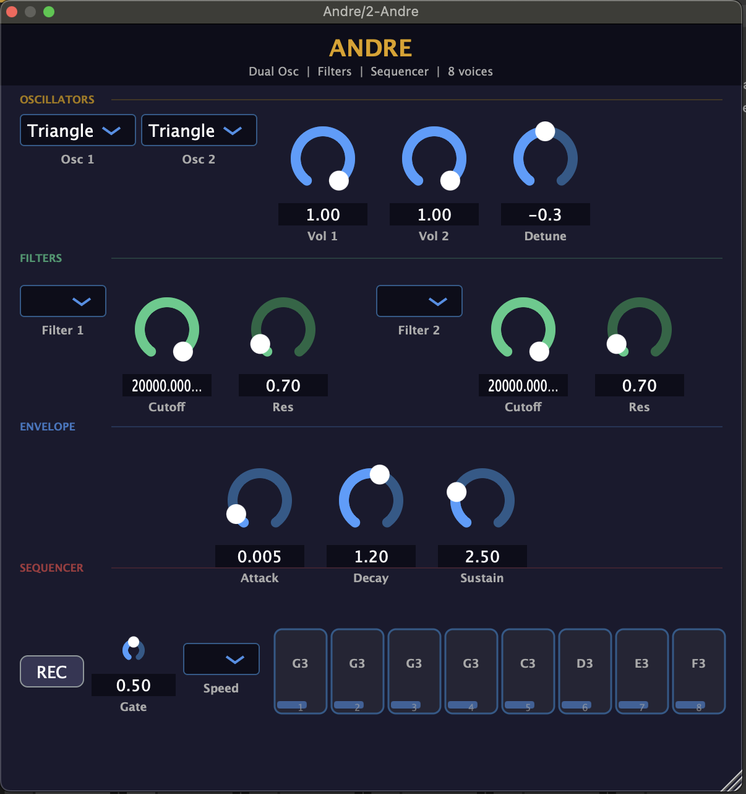

# Andre — Dual Oscillator Synth

A VST3/AU synthesizer plugin for macOS, built with JUCE.



## Download & Install

👉 **[Download latest installer (macOS)](../../releases/latest)**

### Requirements
- macOS 11 or later
- Any DAW supporting VST3 or AU (Ableton Live, Logic Pro, Reaper, etc.)

### Installation
1. Download `Andre-macOS.pkg` from the link above
2. Double-click the `.pkg` file and follow the installer
3. Open your DAW and rescan plugins
4. Find **Andre** under Instruments → VST3 or AU

> If macOS blocks the installer: **System Settings → Privacy & Security → Open Anyway**

---

## Features

- **Dual oscillator synthesis** — Sine, Saw, Square, Triangle per oscillator
- **Per-oscillator filters** — Low Pass, High Pass, Band Pass with Cutoff and Resonance
- **ADSR envelope** — Attack, Decay, Sustain
- **8-step sequencer** — synced to host BPM
- **8-voice polyphony**

---

## Oscillators

| Control | Description |
|---|---|
| Osc 1 / Osc 2 | Waveform selector (Sine / Saw / Square / Triangle) |
| Vol 1 / Vol 2 | Independent volume per oscillator (0–1) |
| Detune | Osc 2 pitch offset in cents (−50 to +50) |

## Filters

Each oscillator has its own filter:

| Control | Description |
|---|---|
| Filter type | Off / LP (Low Pass) / HP (High Pass) / BP (Band Pass) |
| Cutoff | Filter cutoff frequency (20 Hz – 20 kHz) |
| Res | Resonance / Q factor |

## Envelope

| Control | Range | Description |
|---|---|---|
| Attack | 1 ms – 2 s | Time to reach full volume |
| Decay | 10 ms – 5 s | Time to fall to sustain level |
| Sustain | 0 – 10 | Level held while key is pressed |

## Sequencer

### How to record a sequence
1. Click **REC** (turns red)
2. Play up to 8 notes on your MIDI keyboard — each note fills the next step
3. Recording stops automatically after 8 notes
4. Press **Play** in your DAW — the sequencer starts

### Controls

| Control | Description |
|---|---|
| REC | Record mode — incoming notes fill sequencer steps |
| Gate | Note duration per step (5% = staccato, 95% = legato) |
| Speed | Playback speed: `1/2` `1x` `2x` `4x` |
| Step buttons | Click to toggle each step on/off |

- The **active step** highlights in gold during playback
- The **velocity bar** at the bottom of each step shows recorded velocity
- Steps and sequence are saved with your DAW project

---

## Build from Source

### Requirements
- macOS with Xcode Command Line Tools
- CMake 3.22+
- Git

```bash
git clone --recurse-submodules https://github.com/figueiredouc/andre-synth
cd andre-synth
git clone --depth=1 https://github.com/juce-framework/JUCE ../JUCE
cmake -B build -DCMAKE_BUILD_TYPE=Release
cmake --build build --config Release
```

Outputs in `build/Andre_artefacts/Release/`:
- `VST3/Andre.vst3`
- `AU/Andre.component`
- `Standalone/Andre.app`

---

## License

MIT
